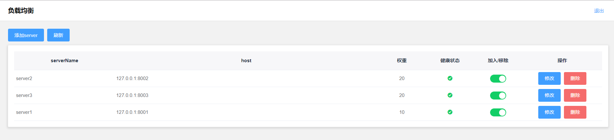
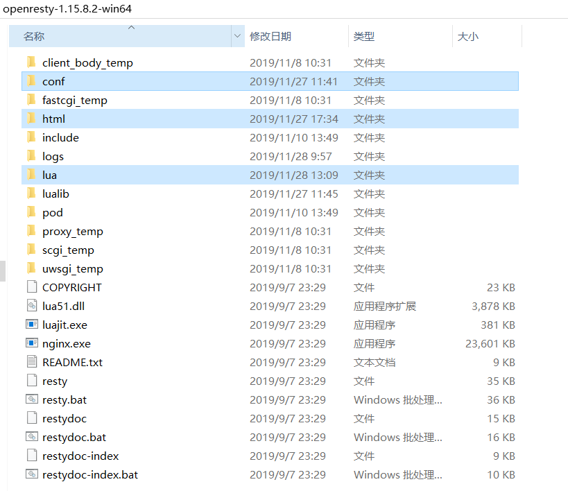

# DLB
openresty动态负载均衡

基于openresty开发的动态负载均衡。可动态配置upstream,分配权重，自动生效。

1.安装

    请先安装openresty，版本选择1.15以上版本。
    复制html目录到openresty根目录下。
    复制lua目录到openresty根目录下。
    复制/conf/nginx.conf文件 /conf/proxy_new.json文件到 openresty根目录下的conf目录，覆盖nginx.conf文件。
    
   
2.运行

    linux下执行：nginx -c nginx.conf   
    windows下执行：  start nginx
   
3.配置

    修改登录密码， 修改文件/lua/password.lua   
    --默认密码   
    local defaultPassword = "admin"
   
4.其它

    管理端口为8000,进入管理界面: http://localhost:8000/
    负载均衡对外端口为80，可修改nginx.conf来配置这个端口
    增加server或者删除server，负载均衡会自动生效。
    
 初次在openresty上开发，欢迎大家指正。
   
